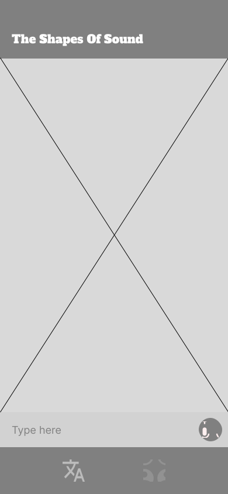
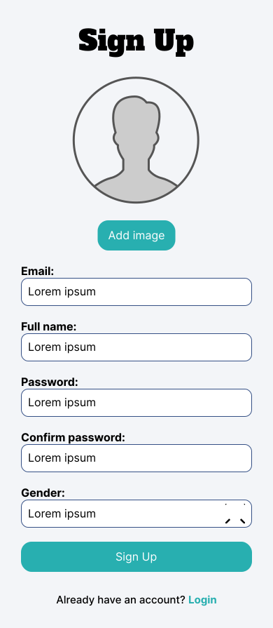
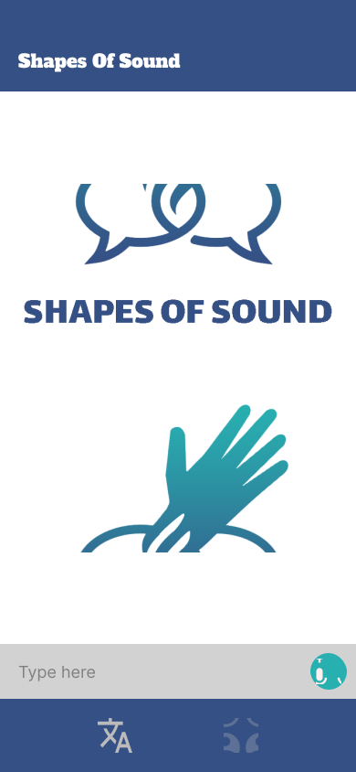

<div align="center">

> The Shapes Of Sound app is designed to turn speech into sign language.

**[PROJECT PHILOSOPHY](https://github.com/petersaba/shapes-of-sound#-project-philosophy) • [PROTOTYPING](https://github.com/petersaba/shapes-of-sound#-wireframes) • [TECH STACK](https://github.com/petersaba/shapes-of-sound#-tech-stack) • [IMPLEMENTATION](https://github.com/petersaba/shapes-of-sound#-impplementation) • [HOW TO RUN?](https://github.com/petersaba/shapes-of-sound#-how-to-run)**

</div>

<br><br>


> The Shapes Of Sound is utility app built to help people communicate with each other using sign language as well as understand sign language.
>
> The Shapes Of Sound app can also help people to learn sign language.

### User Stories
- As a user, I want to convert my speech to sign language, so that I can communicate with people
- As a user, I want to convert other people's speech to sign language, so that I can communicate with people
- As a user, I want to convert my speech to sign language, so that I can learn sign language

<br><br>


> This design was planned before on paper, then moved to Figma app for the fine details.
Note that i didn't use any styling library or theme, all from scratch and using pure css modules

<br>
<b>WIREFRAMES</b>
<br><br>

| Landing  | Sign Up  |
| -----------------| -----|
|  |  |

| Edit Profile  | Home  |
| -----------------| -----|
|  |  |


<br>

<b>MOCKUPS</b>
<br><br>

| Landing  | Sign Up  |
| -----------------| -----|
|  |  |

| Edit Profile  | Home  |
| -----------------| -----|
|  |  |


<br><br>


Here's a brief high-level overview of the tech stack the Well app uses:

- This project uses the [Flutter app development framework](https://flutter.dev/). Flutter is a cross-platform hybrid app development platform which allows us to use a single codebase for apps on mobile, desktop, and the web.
- In order to build the speech recognition model, the app uses [TensorFlow](https://www.tensorflow.org/learn) along with [Keras](https://keras.io/api/) to build the transformer neural network. [TensorFlow](https://www.tensorflow.org/learn) is an open-source library developed by Google primarily for deep learning applications. It also supports traditional machine learning. [Keras](https://keras.io/api/) is an open-source software library that provides a Python interface for artificial neural networks. Keras acts as an interface for the TensorFlow library.
- This project uses the [Laravel](https://laravel.com/docs/9.x) for the backend. Laravel is a cross-platform PHP framework for building web applications. It's a server-based platform that manages data using the Model-View-Controller (MVC) design pattern, dividing an application's backend architecture into logical pieces.
- For persistent storage (database), the app uses the [MySQL](https://www.mysql.com/) relational database management system that is based on Structured Query Language(SQL).


<br><br>


> Uing the above mentioned tecch stacks and the wireframes build with figma from the user sotries we have, the implementation of the app is shown as below, these are screenshots from the real app

| Landing  | Home/Search  |
| -----------------| -----|
|  |  |


<br><br>


> This is an example of how you may give instructions on setting up your project locally.
To get a local copy up and running follow these simple example steps.

### Prerequisites

This is an example of how to list things you need to use the software and how to install them.
* npm
  ```sh
  npm install npm@latest -g
  ```

### Installation

_Below is an example of how you can instruct your audience on installing and setting up your app. This template doesn't rely on any external dependencies or services._

1. Get a free API Key at [https://example.com](https://example.com)
2. Clone the repo
   ```sh
   git clone https://github.com/your_username_/Project-Name.git
   ```
3. Install NPM packages
   ```sh
   npm install
   ```
4. Enter your API in `config.js`
   ```js
   const API_KEY = 'ENTER YOUR API';
   ```


